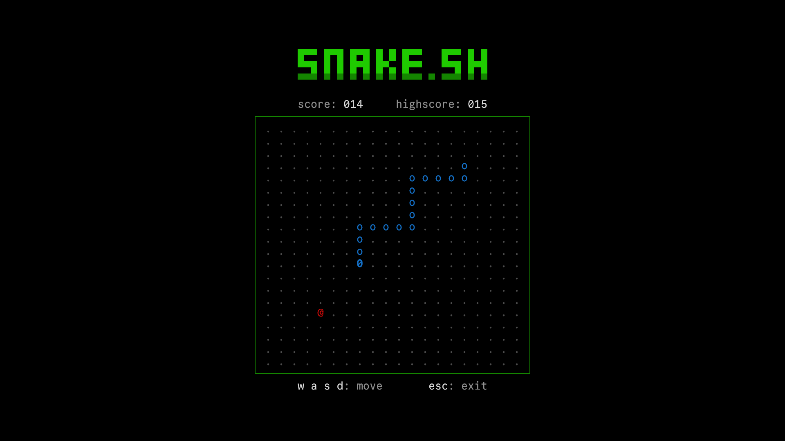

<div align="center">

## 🐍 snake.sh

A text-based snake game

|  |
| :-----------------------: |

</div>

#

### How to play

To play without downloading, run:

```bash
bash <(curl -s https://raw.githubusercontent.com/sejjy/snake/main/snake.sh)
```

Otherwise, clone the repository and run `./snake.sh`:

```bash
git clone https://github.com/sejjy/snake.git
cd snake
./snake.sh
```

Or:

```bash
git clone https://github.com/sejjy/snake.git && cd snake && ./snake.sh
```

#

### Known issue

- The apple can sometimes spawn in the body

#

### References

- [ANSI Escape Sequences](https://gist.github.com/fnky/458719343aabd01cfb17a3a4f7296797)
- [snake-term](https://github.com/abuharth/snake-term)
